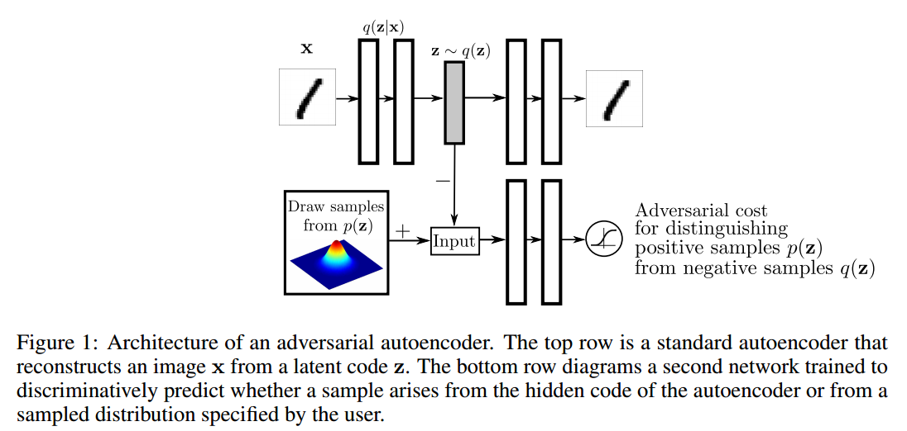
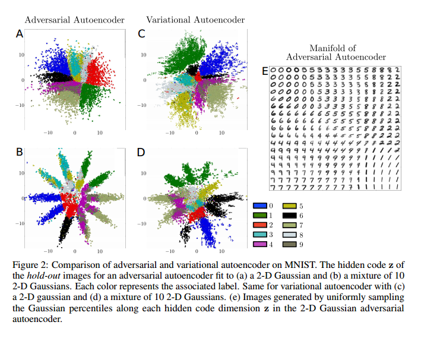
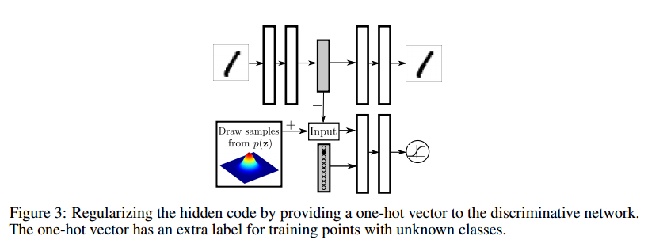
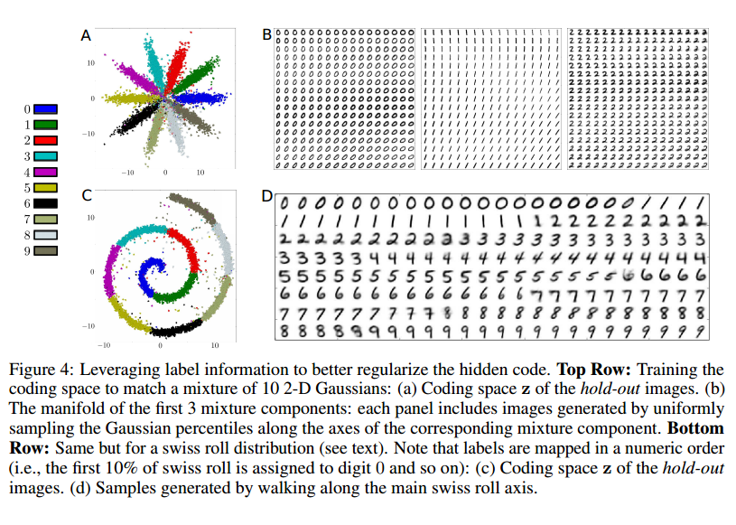
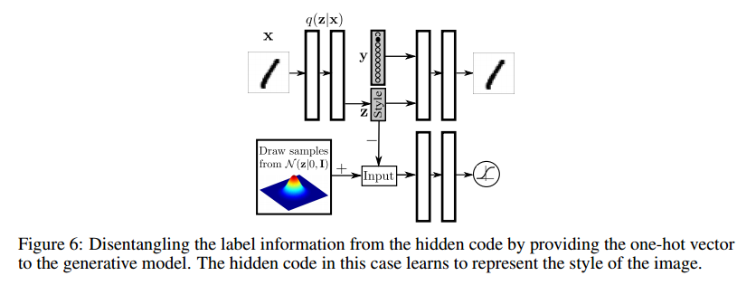
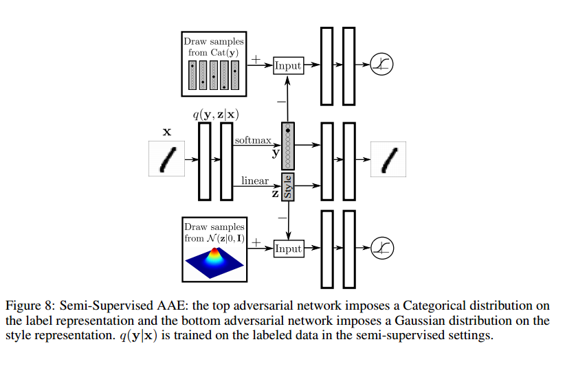
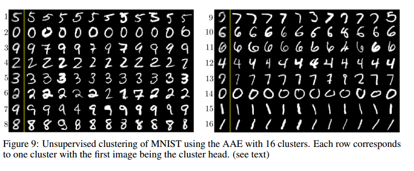
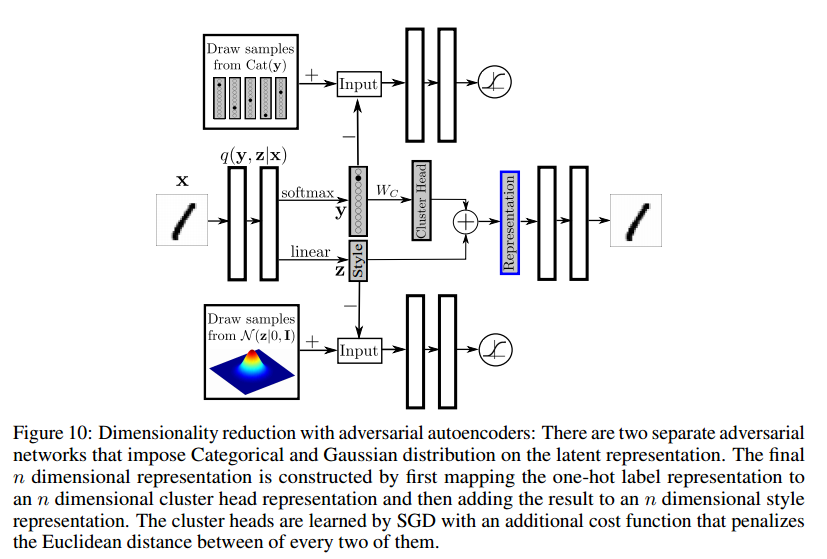

# 论文阅读 Adversarial Autoencoders

* [paper](paper/25.901-2015-Adversarial-Autoencoders.pdf)

### Abstract

* 提出对抗自编码，它是一种概率自编码器，使用（GAN）思想将自编码器的隐藏编码向量的聚合后验与任意先验匹配。
* 匹配聚合后验和先验确保了从先验空间的任何部分生成的数据都可以产生一个有意义的结果。
* 用于半监督分类, 图像的内容和分格迁移, 无监督聚类, 降维和数据可视化.

### 1 Introduction

* 利用自编码网络重构图像。
* 利用对抗网络匹配聚合后验和任意先验。也就是让学习到的分布逼近任意的先验。
* 这个训练过程导致编码器学习转化数据分布到先验分布，解码器学习将施加的先验分布映射到数据分布。

#### 1.1 Generative Adversarial Networks

* 判别器： D(x)
* 生成器： G(z)

#### 2 Adversarial Autoencoders

* 输入x, 隐变量编码z;
* 先验分布 p(z); 
* 编码的分布：q(z|x); 
* 解码的分布 p(x|z) ;
* 数据的分布： pd(x); 
* 模型的分布：p(x);

* 对抗自编码通过约束聚合后验分布q(z)和任意先验分布 p(z)的匹配训练。
* 这里先验分布有几个选择
    * Deterministic（固定）：
        * 这里假定p(z|x)是一个关于x的固定函数。
        * 这和传统的编码器一样，q（z）中的随机性的唯一来源是数据分布pd（x）。
    * 高斯：
        *  zi ∼ N(µi(x), σi(x))
        * q（z）中的随机性的唯一来源是数据分布pd（x）和高斯函数.
    * Universal approximator posterior:
        * 假设对抗自编码的编码网络是函数 f(x, η),随机噪声η来自一个固定分布(如Gaussian). 
        
* 固定分布得到的编码是映射是固定的，这导致q(z)不是那么平滑，也就是无法识别不在训练集中的数据。

#### 2.1 Relationship to Variational Autoencoders

* 前两张是2D高斯，都分得很好，但是VAE有空隙，没有覆盖全面，后两张是10个混合2D高斯，
 可以看到VAE还是按照一个2D高斯的成分处理，AAE数据存在几个高斯分布混合的情况， 说明AAE学的更好。
* AVE需要知道先验分布的函数形式（mean和std）. AAEs只要能够在分布中采样就可以（知道服从正太分布就可以）。
* AVE中鼓励q(z)选择p(z)的模式，而AAE中鼓励p(z)学习p(z)的整个分布。
 
 
#### 2.2 Relationship to GANs and GMMNs

* 在原始生成敌对网络（GAN）中，GAN被用来在神经网络的输出层上的像素级施加数据分布。
然而对抗自编码器依赖训练自编码器来捕获数据分布。
* 在低维上再施加分布约束。

### 2.3 incorporating Label Information in the Adversarial Regularization (将标签信息纳入对抗正则化)

* 再有标签的数据中，我们可以利用标签数据学习到更好的编码。
* 加入one-hot信息，前10 表示了混合成分的边界, The extra class in the one-hot vector corresponds.

### 3 Likelihood Analysis of Adversarial Autoencoders

* 通过比较这个模型的似然和生成的图片,AAE作为生成模型捕获数据分布的能力.
* 我们通过在保持测试集上计算其对数似然性来评估对抗自编码器的性能。

### 4 Supervised Adversarial Autoencoders

* 为了包含标签信息，我们修改网络结构，给解码层加入one-hot的标签信息。用标签和编码重构图片。
* 标签含内容，编码学习风格。

### 5 Semi-Supervised Adversarial Autoencoders

* 利用标签数据约束训练编码器。

### 6 Unsupervised Clustering with Adversarial Autoencoders

* 去掉半监督层，然后q(y|x) 预测一个one-hot的向量，维度是我们希望的聚簇数目。
* 度量：
    * 一旦训练完成，对于每个集群i，我们找到验证示例xn，使q（yi | xn）最大化，并将xn的标签分配给集群i中的所有点。
    然后，我们根据为每个集群分配的类标签计算测试错误。

### 7 Dimensionality Reduction with Adversarial Autoencoders

* 

### 8 Conclusion